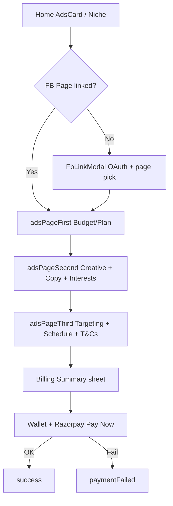

# LeadKart — Meta Ads UI Full Spec

> **Purpose:** AI / designer ke liye complete UI reconstruction guide for LeadKart **Meta / Facebook Ads**.  
> Is document se Ads list, create wizard, detail analytics, restart, niche plans, admin Live Monitor, aur Link Meta Ad UI banayi ja sakti hai.  
> **Last updated:** July 15, 2026  
> **Primary surface:** Mobile App (Expo / React Native)  
> **Also covered:** Admin Panel + Desktop Web

---

## Table of Contents

1. [Product Overview](#1-product-overview)
2. [Surfaces & Entry Points](#2-surfaces--entry-points)
3. [Design System](#3-design-system)
4. [Information Architecture & Flows](#4-information-architecture--flows)
5. [Mobile Screens (Full Detail)](#5-mobile-screens-full-detail)
6. [Shared Components & Sheets](#6-shared-components--sheets)
7. [Status Badges & KPI Maps](#7-status-badges--kpi-maps)
8. [Desktop Web UI](#8-desktop-web-ui)
9. [Admin Panel UI](#9-admin-panel-ui)
10. [Copy / Microcopy Bank](#10-copy--microcopy-bank)
11. [AI Prompt Pack](#11-ai-prompt-pack)
12. [File Map](#12-file-map)
13. [Acceptance Checklist](#13-acceptance-checklist)

---

## 1. Product Overview

**Meta Ads** LeadKart ka core revenue module hai jahan business owners:

1. Facebook / Instagram pe ads chalane ke liye **FB Page link** karte hain  
2. Ad objective choose karte hain (Lead, WhatsApp, Traffic, Sales, Awareness, Engage, App Install, Call…)  
3. **Budget / Plan** select karke creative + copy + interests + geo targeting set karte hain  
4. **Wallet / Razorpay** se pay karke Meta pe campaign publish karwate hain  
5. **Ads Report** tab pe Imp / Reach / Leads / Spent dekhte hain  
6. **COMPLETED** ads ko **Restart** kar sakte hain  

Alag se **WhatsApp Marketing** module hai (templates / bulk WA) — yeh doc sirf **Meta / FB Ads** UI cover karti hai.

### Audience by surface

| Surface | Who | Job |
|---------|-----|-----|
| Mobile App | Business owner | Create, pay, track own ads |
| Desktop Web | Business owner | Same wizard, larger layout |
| Admin Panel | LeadKart ops | All-ads table, create/edit for any business, Link Meta Ad, Live Monitor |

---

## 2. Surfaces & Entry Points

### Mobile

| Entry | Behavior |
|-------|----------|
| Bottom tab **Ads** | `/(tabs)/adsPage` — performance list |
| Home → **Choose your Ad requirement** (`AdsCard`) | If FB not linked → `FbLinkModal`; else → `adsPageFirst` |
| Home → **Industry Specific Ads** (`NicheAdModal`) | Niche → Disclaimer → Plans → WA/Lead → skip First → `adsPageSecond` |
| Ad card tap | → `adsDetails` |
| COMPLETED card → Restart | → `restartAds` (permission check) |

`TopDoubleBox` (WhatsApp / GMB) Meta Ads open **nahi** karta.

### Desktop
- Sidebar / home → budget → createAnAds wizard → payment  
- `/adsDashboard` card grid list → `/adsDashboard/adDetail/:adId`

### Admin
- Sidebar **Ads** → `/ads`  
- **Live Ads** → `/ads/live-monitor`  
- In-page: Create Ads, Link Meta Ad, detail `/ads/[id]`, edit `/ads/ad_form/[id]`

---

## 3. Design System

### 3.1 Color tokens (Mobile)

```
Brand Indigo (primary):
  #3F51B5   — headers CTAs, Help pill, checkboxes, tab accents
  #2563eb   — alternate active blue

Facebook:
  #1877F2   — FB brand / link flows

Neutrals:
  #FFFFFF #000000
  #F4F4F4   — soft band / divider
  #C1C1C1   — adsDetails page bg (lightGray)
  gray20–gray90 scale (#CCCCCC … #191919)

Semantic (status — see §7):
  Active #4CAF50 · In Review #FFC107 · Completed #2196F3
  In Progress / Preparing #FFA726 · Paused #FF5722
  Delivery Error #f01334 · Danger #fc030b

Payment:
  Razorpay theme #F37254

Engagement accents (detail):
  #FF9800 #2196F3 #4CAF50 #E91E63 #9C27B0
```

### 3.2 Typography

- Expo custom fonts: `regular`, `medium`, `semiBold`, `bold` (Poppins-like)  
- Sizes often relative: `SIZES.width * 0.03` … `0.05`  
- Titles: `semiBold` / `bold`, near-black  
- Subtitles: `gray60`, `regular`  
- **Avoid** system Inter/Roboto when recreating LeadKart look  

### 3.3 Surfaces

- Cards: white, radius **10–16**, light shadow (`opacity` ~0.05–0.09)  
- Primary CTAs: full-width **pill** (`borderRadius: 100`), indigo fill, white label  
- Checkboxes: circular, fill `#3F51B5` + white check  
- Bottom sheets: billing / filter / media type  
- Performance cards: full-bleed creative + dark gradient footer metrics + floating status pill  

### 3.4 Design language (for AI)

> LeadKart Meta Ads is **Indigo SaaS mobile UI** with **Material status colors**.  
> Ads performance cards feel like marketing reports (creative hero + KPI footer).  
> Create flow is a **3-step wizard + payment sheets**, gated on Facebook page linked.  
> Do **not** copy WhatsApp green chrome here — indigo is king; FB blue only for OAuth/link.

---

## 4. Information Architecture & Flows

### 4.1 Standard create flow



### 4.2 Niche / Industry Specific path

```
NicheAdModal → Disclaimer → Plan cards
  → Ad type (WhatsApp / Lead Ads)
  → adsPageSecond  (skips First; FB/IG budget pre-split 50/50)
  → adsPageThird → payment → success
```

### 4.3 Restart flow

```
Ads tab card (COMPLETED) → restartAds
  → New budget/plan + dates (± ₹500 steps)
  → Billing sheets → resetAdsAPi → back to list
```

### 4.4 Admin ops flow

```
/ads table → CreateAdsForm | Link Meta Ad | Live Monitor
Link Meta → Meta ID + Business phone/name → sync creative to apps
Live Monitor → poll every 30s from Meta
```

### 4.5 Business rules UI must enforce

| Rule | UX |
|------|-----|
| FB page must be linked | Create gated; `FbLinkModal` |
| Custom budget daily floor | `max(fb,ig) / days >= ₹250` else red chip; block submit |
| Custom min budget step | Create First: ± ₹**1000**, min ~1000; Restart: ± ₹**500** |
| Plan vs custom | Selecting plan clears custom budgets (and reverse) |
| Media | Max **5 images** OR **1 video** |
| Interests | ≥1 required |
| WhatsApp / Call ads | 10-digit mobile required; destination URL optional |
| App Install | Platform + App Id required |
| T&Cs | Must check before pay |
| Payable | Plan price **or** FB+IG budgets (+ GST / fees in sheets) |

---

## 5. Mobile Screens (Full Detail)

---

### 5.1 Ads Tab — Performance List

**File:** `src/app/(main)/(tabs)/adsPage.js`  
**Goal:** Show all created ads (LeadKart internal + Meta-linked) with live KPIs.

```
┌─────────────────────────────────────┐
│ [Help?]                    [filter] │
├─────────────────────────────────────┤
│ Your Created Ads Report             │
│ You can see your ad performance…    │
├─────────────────────────────────────┤
│ ┌─────────────────────────────────┐ │
│ │ [STATUS PILL]                   │ │
│ │         CREATIVE / THUMB        │ │
│ │ Performance title               │ │
│ │ Imp | Views | Leads | Spent     │ │
│ │              [Restart if Done]  │ │
│ └─────────────────────────────────┘ │
│ … FlatList / shimmer / demo / empty │
└─────────────────────────────────────┘
     AdsFilterSheet (bottom)
```

**Elements**
- Help pill `#3F51B5` → dial company phone  
- Filter → bottom sheet of ad-type radios + Clear  
- `AdsPerformanceCard` / `DemoAdsCard`  
- Pull-to-refresh; pagination; socket new-lead toast; ~60s poll  

**States**

| State | UI |
|-------|-----|
| Loading | `AdLoader` (3 shimmer cards) |
| No real ads | Demo cards from `adsDemoData` |
| Filter empty | `images.noData` + “No ads for selected filter” |
| Tap | → `adsDetails` |
| COMPLETED | Restart → `restartAds` |

**Card data:** impressions, reach, type-mapped KPI (Leads/Clicks/…), `totalSpendBudget`, status, optional FB page name for Meta-linked ads.

---

### 5.2 Create Step 1 — Budget / Plan

**File:** `adsPageFirst.js`  
**Title pattern:** `Create {adType}`

```
┌─────────────────────────────────────┐
│ ← Create Lead Ads                   │
├─────────────────────────────────────┤
│ Total Budget                        │
│ ( ) [FB] [ −  1000  + ]             │
│ ( ) [IG] [ −  1000  + ]             │
│ Note: Link Instagram to FB page…    │
│ ┌ Estimated Result ───────────────┐ │
│ │ Views K–K · Leads/Clicks …      │ │
│ └─────────────────────────────────┘ │
│ OR                                  │
│ Select a plan                       │
│ [PlanCard · duration · price · KPI] │
│ ──── band ────                      │
│ PackageInclude · FAQ accordion      │
├─────────────────────────────────────┤
│              [ Next ]               │
└─────────────────────────────────────┘
```

**Rules**
- Need `planId` **or** facebook/insta budget  
- Days estimate ≈ `maxBudget / 250`  
- AnalyticCard when custom platform budget selected  
- Next → `adsPageSecond`  

**Params in:** `{ type, adId }`

---

### 5.3 Create Step 2 — Creative + Copy

**File:** `adsPageSecond.js`  
**Title:** Create an ads

```
┌─────────────────────────────────────┐
│ Create an ads                       │
├─────────────────────────────────────┤
│ [Upload Media] [LeadKart.ai custom] │
│ [thumbs / video + upload %]         │
│ [✦ Generate content with AI]        │
│ Campaign Name *                     │
│ Ad Headline *                       │
│ Primary Text *                      │
│ Ad Caption *                        │
│ (App Id / Platform) if Install      │
│ (WhatsApp / Call number) if WA/Call │
│ Destination URL                     │
│ Search and select interest * →      │
│ [interest chips ×]                  │
├─────────────────────────────────────┤
│              [ Next ]               │
└─────────────────────────────────────┘
  Sheets: Media Type (Image/Video)
          Platform (Android/iOS)
```

| Field | Required |
|-------|----------|
| Media | Yes (max 5 images / 1 video) |
| Campaign Name, Headline, Primary Text, Caption | Yes |
| Interests (≥1) | Yes |
| Destination URL | Yes except WA / Call / some Lead |
| Mobile 10-digit | WA / Call |
| App Id + Platform | App Install |

**Nav:** `adsPageThird` · `customizedImg` · `targetInterest`  
Back saves draft into `adsProvider`.

---

### 5.4 Create Step 3 — Targeting + Pay

**File:** `adsPageThird.js`  
**Title:** Ad Campaign Settings

```
┌─────────────────────────────────────┐
│ Ad Campaign Settings                │
├─────────────────────────────────────┤
│ ⚠ Daily budget < ₹250 chip (if any) │
│ Select the gender                   │
│ [✓] Male  [✓] Female                │
│ Target Areas                        │
│ [🔍 Search Target Area]             │
│ [location chips ×]                  │
│ Ad Schedule   Start | End           │
│ Running Interval Start | End times  │
│ Age Range 18 ──●════●── 65          │
│ ( ) I agree with Terms & Condition  │
├─────────────────────────────────────┤
│ Billing ↓            [ Next ]       │
└─────────────────────────────────────┘
 → CheckoutPriceModal (Billing Summary)
 → CheckoutFinalModal (Wallet + Razorpay)
 → success | paymentFailed
```

**Validation:** gender ≥1, dates/times, ≥1 location, T&Cs, daily ≥ ₹250 for custom budget.  
**Nav extras:** `targetArea`, `company` (terms).

---

### 5.5 Ad Detail / Analytics

**File:** `adsDetails.js`

```
┌─────────────────────────────────────┐
│ Ad Detail                           │
├─────────────────────────────────────┤
│ ┌ Card ───────────────────────────┐ │
│ │ [thumb] Title  [STATUS]         │ │
│ │ start – end / Running           │ │
│ │ [ media image / video / WebView]│ │
│ │ Platforms | Total Budget | Area │ │
│ │              See all target →   │ │
│ └─────────────────────────────────┘ │
│ Your ad reached N people            │
│ status message (color-coded)        │
│ ┌ Views ┐ ┌ Clicks ┐               │
│ ┌ Leads ┐ ┌ Budget Used ┐          │
│ ─── Age bar chart ───               │
│ Post Engagement metrics             │
│ Gender: Male / Female / Other %     │
└─────────────────────────────────────┘
```

- Loader: `AdsDetailsLoader`  
- Refresh + ~30s auto-refresh  
- Charts: age / gender / region  
- Engagement: bookmarks, link clicks, reactions…  
- Third KPI cell depends on ad type (Conversation / Leads / Impressions)

---

### 5.6 Restart Ads

**File:** `restartAds.js`

- UI ≈ First step (budget/plan) + **Start/End date pickers**  
- Budget stepper ± **₹500**  
- Plan auto end date from plan duration  
- Billing sheets → `resetAdsAPi` → `router.back()`  
- LimitChip if daily < ₹250  

---

### 5.7 Niche Ad Modal (Home)

**File:** `components/NicheAdModal` (and related)

```
Niches (e.g. Real Estate #1565C0, Hotel #00695C)
  → Disclaimer
  → Plan cards (bronze / indigo #3F51B5 / orange)
      Meta badge · FB+IG logos · GST-included
      CTA: Start {Plan} Plan
  → Ad requirement: WhatsApp / Lead Ads
  → adsPageSecond
```

---

### 5.8 Facebook Link Modal

**Component:** `FbLinkModal` (+ `facebookService` / `facebooklogin`)

- Shown when `isFacebookPageLinked === false`  
- Facebook Login → Graph `me/accounts` → pick Page → link to business  
- Also used from `viewBusiness` / business flows  
- Brand blue `#1877F2`

---

## 6. Shared Components & Sheets

| Component | Role |
|-----------|------|
| `AdsPerformanceCard` | Real ad card: creative, status pill, KPIs, Restart |
| `DemoAdsCard` | Same layout + “Demo Ad” |
| `AdsFilterSheet` | Ad-type radio filter + Clear |
| `AdsPlanCard` | Plan pick on First / Restart |
| `AnalyticCard` | Estimated Views / Leads for custom budget |
| `PackageInclude` | What’s included under plans |
| `FaqCard` | FAQ accordion (ADD_PLAN) |
| `CheckoutPriceModal` | Billing: Ads Amount, GST %, Platform fee, Gateway fee, Total |
| `CheckoutFinalModal` | Leadkart Wallet + Razorpay remainder → **Pay Now** |
| `AdLoader` / `AdsDetailsLoader` | Structure-matched shimmers `#e3e3e3` / `#f0f0f0` |
| `NicheAdModal` | Industry packages entry |
| `FbLinkModal` | FB page connect gate |

---

## 7. Status Badges & KPI Maps

### 7.1 Mobile status colors

| Status | Hex | Label |
|--------|-----|--------|
| `ACTIVE` | `#4CAF50` | Active |
| `IN_REVIEW` | `#FFC107` | In Review |
| `COMPLETED` | `#2196F3` | Completed |
| `IN_PROGRESS` | `#FFA726` | In Progress |
| `PAUSED` | `#FF5722` | Paused |
| `PREPARING` | `#FFA726` | Preparing |
| `SCHEDULE` | `#4CAF50` | Schedule |
| `DELIVERY_ERROR` | `#f01334` | Delivery Error |

### 7.2 List KPI label by ad type

Examples mapped on cards: **Click · Lead · Traffic · Sales · Awareness · Engage · Install · Call**  
Footer typically: **Imp. · Ad views (reach) · type KPI · Spent**

### 7.3 Admin / Live Monitor palettes

See [§9](#9-admin-panel-ui) — Live Monitor uses distinct hexes (`#00C853`, `#FF9100`, …) and a red **LIVE** chip.

---

## 8. Desktop Web UI

**Root:** `leadkartDesktop-master/`

### Routes

| Path | Step |
|------|------|
| `/home/:id/totalBudget` | Plan / budget |
| `.../createAnAds` | Creative + copy + AI |
| `.../adCampaignSettings` | Targeting + billing |
| `.../purchaseGarphic` | AI graphic |
| `/home/totalBudget/createAnAds/paymentCard` | Payment |
| `/adsDashboard` | Card list |
| `/adsDashboard/adDetail/:adId` | Detail |

### CreateAnAds (creative step) highlights

- Two dashed cards: **Upload Media** · **Get customized ad image from Leadkart.ai**  
- Media Type modal → Image (multi ≤5) / Video (1)  
- **Generate content with AI**  
- Same copy fields as mobile; type-specific WhatsApp / App fields  
- Continue → AdCampaignSettings (age slider, gender, map areas, schedule, GST summary, T&Cs)

### AdsDashboard

- Filter by ad type  
- Cards: media, status pill (Tailwind green/yellow/orange/purple/blue/red), Imp / Reach / Leads|Clicks / Spent  

**Note:** Desktop is user wizard/cards — **not** a clone of Admin MUI tables.

---

## 9. Admin Panel UI

**Root:** `admin/src/pages/ads/`  
**Stack:** Next.js + MUI  
**Nav:** Ads (`/ads`), Live Ads (`/ads/live-monitor`) — permission `ADS`

---

### 9.1 Ads List — `/ads`

**Header actions:** Search · Ad Type select · Status select · **Live Monitor** (red gradient + pulse) · **Link Meta Ad** · **Create Ads**

**Table columns**

| Col | Content |
|-----|---------|
| S No. | Pagination-aware |
| Image | Thumbnail avatar |
| Campaign Name | *(shows businessName in current code)* |
| Business Page | `pageName` |
| Ads Type | `addTypeId.title` |
| Total Budget | |
| Ads Created Date | |
| Status | Chip → change-status menu |
| Action | Edit / View / User Details |

**Status menu values:** ACTIVE · PAUSED · DELETED · ARCHIVED · IN_REVIEW · IN_PROGRESS · COMPLETED · SCHEDULED  

Chip colors (MUI): success / warning / error / primary / info / secondary.

---

### 9.2 Create Ads Form — `/ads/CreateAdsForm`

Single long form (not wizard). Title: **Create Ads Form**

| Section | Fields |
|---------|--------|
| Identity | Select Business (async), Advertisement Type, Plan Type, Campaign Name |
| Copy | Headline, Primary Text, Caption |
| Contact / URL | WhatsApp (if WA/Call types), Destination URL |
| Budget | FB/IG ±500 if no plan |
| Audience | Age From/To, Days multi, Gender multi |
| Schedule | Start/End date & time |
| Money | Service Amount |
| Location | City search (Nominatim) + radius slider 8km–100km + map |
| Creative | Multi image XOR single video + previews |
| Interests | Autocomplete chips |

CTA: **Create Ads** → upload → `createAdsDetails` → `/ads`.

---

### 9.3 Edit Ads — `/ads/ad_form/[id]`

Same layout; business/type/plan **disabled**; shows total budget + created date; CTA **Update Ads**.

---

### 9.4 Ad Detail — `/ads/[id]`

Ops media viewer (not full analytics):
- Header: title, business, type chip, status chip, page name  
- Video: Meta plugin iframe or `<video>` + Download  
- Images: Swiper + Download  
- MediaUnavailable empty state  

---

### 9.5 Live Ads Monitor — `/ads/live-monitor`

```
← Back   Live Ads Monitor  [LIVE]   [Refresh Now]
Updated Xs ago · Auto-refresh 30s

[ Active ][ In Review ][ Preparing ][ Paused ][ Completed ][ Total ]

Today: Reach · Impr · Clicks · Spend · Leads   (if Active > 0)

⚠ Ending Soon (0–3 days) banner…

Filters: Search · Status
Table: Status · Business · Type · Timeline progress · Budget used
       Reach/Impr/Clicks/Leads/Spend Today · Meta sync · Eye
```

- ACTIVE rows green left border; urgent ≤3 days orange  
- Row click → `/ads/{id}`  

---

### 9.6 Link Meta Ad — `/ads/link-meta-ad`

Per `META_AD_GUIDE.md`:

| Field | Required |
|-------|----------|
| Meta Campaign ID / Ad ID | Yes |
| Business Phone Number / Name | Yes (newest business if duplicate phone) |
| Page Name (optional) | Override display name |

CTA: **Link Meta Ad** → `POST business/linkMetaAd` → creatives sync to mobile.

---

### 9.7 Admin vs Mobile

| Dimension | Admin | Mobile |
|-----------|-------|--------|
| Scope | All businesses | Own business |
| Create | One MUI form | 3-step wizard + pay |
| Link Meta | Yes | Consume only |
| Live Monitor | Yes (30s) | Per-ad detail |
| Status force-change | Chip menu | Product flows |
| List density | Table | Creative cards |
| AI / wallet UX | Limited | First-class |

---

## 10. Copy / Microcopy Bank

| Context | Copy |
|---------|------|
| Ads tab title | Your Created Ads Report |
| Ads tab subtitle | You can see your ad performance… |
| Help | Help? |
| Empty filter | No ads for selected filter |
| Demo badge | Demo Ad |
| Step 1 | Total Budget · Select a plan · Next |
| Step 1 note | Link Instagram to FB page… |
| Step 2 title | Create an ads |
| AI CTA | Generate content with AI |
| LeadKart custom | LeadKart.ai custom / Get customized ad image… |
| Interest | Search and select interest |
| Step 3 title | Ad Campaign Settings |
| Gender | Select the gender |
| Areas | Target Areas · Search Target Area |
| Schedule | Ad Schedule · Running Interval |
| T&Cs | I agree with Terms & Condition |
| Billing | Billing Summary · Total Payable · Pay Now |
| Detail | Ad Detail · Your ad reached N people · See all target |
| Restart | Restart (COMPLETED) |
| Niche CTA | Start {Plan} Plan |
| Admin Live | Live Ads Monitor · LIVE · Ending Soon |
| Admin Link | Link Manual Meta Ad · Link Meta Ad |

---

## 11. AI Prompt Pack

### Prompt A — Ads performance tab
```
Build a React Native LeadKart Ads tab. Indigo #3F51B5 Help pill + filter.
Title "Your Created Ads Report". Vertical list of performance cards:
full-bleed creative, floating status pill (Material colors: Active #4CAF50,
In Review #FFC107, Completed #2196F3, Paused #FF5722…), dark gradient footer
with Imp / Ad views / Leads-or-Clicks / Spent. Pull-to-refresh, shimmer loader,
demo cards when empty, bottom sheet ad-type filter. COMPLETED shows Restart.
```

### Prompt B — Create wizard Step 1
```
Build adsPageFirst: FB and IG budget steppers ±₹1000 with circular indigo checkboxes,
estimated results AnalyticCard, OR plan cards list, package include + FAQ,
sticky pill Next. Require plan or budget. Estimate days = maxBudget/250.
```

### Prompt C — Create wizard Step 2
```
Build adsPageSecond: Upload Media vs LeadKart.ai custom, AI generate button,
campaign name/headline/primary/caption required, interest chips, type-specific
WhatsApp number or App Id+Platform, destination URL rules, max 5 images or 1 video.
```

### Prompt D — Targeting + checkout
```
Build adsPageThird: gender multi, target area search chips, schedule dates/times,
age range 18–65, T&Cs checkbox, red chip if daily budget < ₹250.
Then Billing Summary sheet (Ads, GST, platform, gateway) and Wallet+Razorpay Pay Now.
```

### Prompt E — Ad detail analytics
```
Build adsDetails: media hero, status badge, platforms/budget/area, reach message,
KPI tiles Views/Clicks/Leads/Budget Used, age bar chart, gender breakdown,
engagement row. Light gray page bg, white cards, 30s refresh.
```

### Prompt F — Admin Live Monitor
```
Build MUI Live Ads Monitor: red LIVE chip, 6 gradient summary cards, today's metrics,
ending-soon alert, searchable status-filtered table with timeline progress,
budget used bars, today Meta metrics, 30s polling.
```

### Prompt G — Link Meta Ad
```
Build admin form: Meta ID, business phone/name, optional page name.
Submit links Meta campaign/ad to newest matching business and syncs creative.
```

---

## 12. File Map

### Mobile (`LeadKart-MobileApp/`)

| Path | Role |
|------|------|
| `src/app/(main)/(tabs)/adsPage.js` | Ads tab list |
| `src/app/(main)/adsPageFirst.js` | Budget / plan |
| `src/app/(main)/adsPageSecond.js` | Creative + copy |
| `src/app/(main)/adsPageThird.js` | Targeting + pay |
| `src/app/(main)/adsDetails.js` | Analytics detail |
| `src/app/(main)/restartAds.js` | Restart completed |
| `src/components/NicheAdModal/` | Industry packages |
| `src/services/facebook/*` | FB OAuth / pages |
| `src/redux/actions/adsActions.js` | API actions |
| `src/components/Loader/AdLoader.js` | List shimmer |
| `src/components/Loader/adsDetailsLoader.js` | Detail shimmer |

### Admin (`admin/src/pages/ads/`)

| Path | Role |
|------|------|
| `index.js` + `AdsTable.js` | List |
| `CreateAdsForm/index.js` | Create |
| `ad_form/[id].js` | Edit |
| `[id].js` | Media detail |
| `live-monitor.js` | Live board |
| `link-meta-ad.js` | Manual Meta link |

### Desktop
`leadkartDesktop-master/src/component/CreateAnAds/` · AdsDashboard routes in `App.jsx`

### Related docs
- `META_AD_GUIDE.md` — Link Meta Ad ops  
- `PROJECT_ANALYSIS.md` — architecture § ads  
- `WHATSAPP_MARKETING_UI_FULL_SPEC.md` — separate WA module UI  

---

## 13. Acceptance Checklist

- [ ] Ads tab with Help + filter + performance cards + demo/empty/loading  
- [ ] Status pills use mobile hex map  
- [ ] FB link gate before create  
- [ ] Niche modal path skips Step 1 with pre-split budget  
- [ ] Step 1: FB/IG steppers + plans + Next gate  
- [ ] Step 2: media XOR rules, AI generate, interests, type fields  
- [ ] Step 3: gender/geo/schedule/age/T&Cs + ₹250 daily floor  
- [ ] Billing + Wallet/Razorpay sheets → success / paymentFailed  
- [ ] adsDetails KPIs + charts + refresh  
- [ ] Restart for COMPLETED (±500, dates, pay)  
- [ ] Admin table + Create/Edit + Link Meta + Live Monitor  
- [ ] Desktop wizard not forced into Admin table UX  

---

**End of spec.**  
AI ko attach karke bolo: *“Is META_ADS_UI_FULL_SPEC ke hisaab se [screen name] banao / redesign karo.”*
