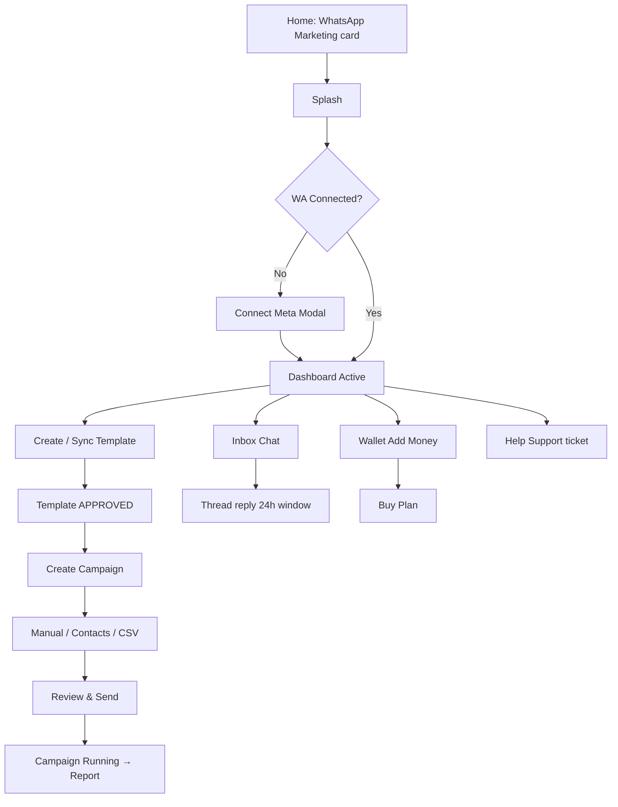

# LeadKart — WhatsApp Marketing UI Full Spec

> **Purpose:** AI / designer ke liye complete UI reconstruction guide.  
> Is document se nayi screen, redesign, ya kisi aur platform par same UI banayi ja sakti hai.  
> **Last updated:** July 15, 2026  
> **Primary surface:** Mobile App (Expo / React Native)  
> **Also covered:** Desktop Web + Admin Panel

---

## Table of Contents

1. [Product Overview](#1-product-overview)
2. [Surfaces & Entry Points](#2-surfaces--entry-points)
3. [Design System](#3-design-system)
4. [Information Architecture & Navigation](#4-information-architecture--navigation)
5. [User Journeys](#5-user-journeys)
6. [Mobile Screens (Full Detail)](#6-mobile-screens-full-detail)
7. [Shared Components](#7-shared-components)
8. [Status Badges & Labels](#8-status-badges--labels)
9. [Desktop Web UI](#9-desktop-web-ui)
10. [Admin Panel UI](#10-admin-panel-ui)
11. [Copy / Microcopy Bank](#11-copy--microcopy-bank)
12. [AI Prompt Pack (Use These Directly)](#12-ai-prompt-pack-use-these-directly)
13. [File Map](#13-file-map)

---

## 1. Product Overview

**WhatsApp Marketing** LeadKart ka nested module hai jahan business owners:

1. Apna **Meta WhatsApp Business** number connect karte hain  
2. **Message templates** banate / Meta se sync karte hain  
3. **Bulk campaigns** Excel/CSV ya contacts se bhejte hain  
4. **CRM Inbox** me customers se 2-way chat karte hain  
5. **Wallet + Plans** se messaging credits / limits kharidte hain  
6. **Help & Support** tickets raise karte hain  

Yeh **standalone WhatsApp clone nahi** hai.  
Chrome / headers LeadKart Indigo brand use karte hain; chat bubbles aur template preview WhatsApp-green realism use karte hain.

### Audience by surface

| Surface | Who | Job |
|---------|-----|-----|
| Mobile App | Business owner | Full day-to-day WA marketing |
| Desktop Web | Business owner | Same journey, larger layout |
| Admin Panel | LeadKart ops | Templates/campaigns oversight, wallet credit, plans CMS, support queue |

---

## 2. Surfaces & Entry Points

### Mobile
- Home tab → `TopDoubleBox` card **"WhatsApp Marketing"** (WhatsApp icon)  
- Route: `router.push("/whatsapp")`  
- Main app bottom tab bar me WhatsApp **hide** hota hai (nested module)

### Desktop
- Sidebar item → `/whatsapp` with green accent when active  
- Sub-tabs: Dashboard · Templates · Campaigns · Chat · Wallet · Plans

### Admin
- Vertical nav section **"WhatsApp Marketing"** (permission `WHATSAPP`)  
- Pages: Templates · Campaigns · Transactions · Plans · Support

---

## 3. Design System

### 3.1 Color tokens

```
Brand Indigo (primary):
  #3F51B5   — headers, active nav, primary CTAs
  #213a8a   — gradient dark end
  #1e40af   — alternate CTA dark

Page backgrounds:
  #F5F7FF   — soft indigo-tint page
  #F8FAFC   — slate-50 lists
  #FFFFFF   — cards

Text hierarchy:
  #0F172A   — titles (slate-900)
  #18181b   — near-black body
  #334669   — secondary
  #64748B   — muted
  #94A3B8   — inactive / placeholders

WhatsApp realism:
  #25D366   — classic WA green
  #128C7E   — darker WA
  #00A884 / #00a884 — send button / action green
  #075E54   — WA header (preview phone)
  #DCF8C6   — outbound bubble
  #EAE6DF / #ECE5DD / #efe7dd — chat wallpaper
  #34B7F1   — blue ticks (read)

Meta / Facebook:
  #1877F2   — Meta blue
  #1565D8   — darker Meta CTA
  #E8F0FE   — light Meta wash

Semantic:
  Success  #22c55e #16a34a #ECFDF5
  Warning  #F59E0B #D97706 #FFFBEB #FEF3C7
  Error    #ef4444 #FEE2E2
  Info     #3b82f6
```

### 3.2 Typography

| Role | Size | Weight | Color |
|------|------|--------|-------|
| Hero title | 32–40 | 900 | White |
| Page title | 20–22 | 800–900 | `#0F172A` |
| Section title | 16–17 | 800 | `#0F172A` |
| Section eyebrow | 11–12 | 700–800 | Uppercase, letter-spacing ~1–1.2 |
| Body | 14–15 | 400–500 | `#334669` / `#18181b` |
| Caption | 11–12 | 500–600 | `#64748B` / `#94A3B8` |
| Nav label | 11 | 600 | Active `#3F51B5` / Inactive `#94A3B8` |

Icons: **Ionicons** (`@expo/vector-icons`).

### 3.3 Surfaces & elevation

- Cards: white, `borderRadius` **16–20**, light border `rgba(0,0,0,0.04)`, soft shadow  
- Hero headers: indigo gradient, bottom corners **radius 32–36**  
- Buttons primary: indigo (or green when campaign success theme) gradient + elevation  
- Chips / pills: status-colored rounded capsules  
- Bottom sheet modals: top radius **24**, drag handle, dim overlay `rgba(15,23,42,0.6)`

### 3.4 Design language summary (for AI)

> LeadKart WhatsApp Marketing is **Indigo-first SaaS UI** with **WhatsApp-green accents** only for connection health, chat CRM, and Meta signup CTAs. Do **not** make the whole app look like WhatsApp. Do make chat threads and template previews look like real WhatsApp.

---

## 4. Information Architecture & Navigation

### 4.1 Mobile shell

Files: `whatsapp/index.js` (or `dashboard.js`) + `_layout.js` (Expo Stack)

```
Open /whatsapp
   ↓
Full-screen Splash (#3F51B5 + LeadkartSplash)
   ↓  [Back to Leadkart chip → /(tabs)]
Tab host with in-memory activeTab
   ├── dashboard  → DashboardScreen
   ├── chat       → ChatScreen (Inbox)
   ├── wallet     → WalletScreen
   ├── profile    → ProfileScreen (Settings)
   ├── contacts / campaigns / templates / … (inner screens via setActiveTab)
   └── help-support → HelpSupportScreen
+ WaveBottomNav (Home / Inbox / Wallet / Settings)
+ Draggable Help FAB (headset) → help-support
```

**Important:** Most inner screens **Expo routes use nahi karti** — `activeTab` state se switch.  
Exceptions with `router.push`:
- Chat thread → `/(main)/whatsapp/screens/ChatThreadScreen`
- Campaign / Template create (some flows stack routes)
- Contact → `/(main)/leadDetails`

### 4.2 WaveBottomNav tabs

| Tab id | Label | Focused icon | Outline icon |
|--------|-------|--------------|--------------|
| `dashboard` | Home | `home` | `home-outline` |
| `chat` | Inbox | `chatbubble-ellipses` | `chatbubble-ellipses-outline` |
| `wallet` | Wallet | `wallet` | `wallet-outline` |
| `profile` | Settings | `settings` | `settings-outline` |

Library: `rn-wave-bottom-bar` (`BottomFabBar`).  
Active tint `#3F51B5`, inactive `#94A3B8`, white bar, elevated focused button with indigo shadow.

### 4.3 Quick Actions MenuGrid

Horizontal scroll titled **"Quick Actions"** — disabled (opacity ~0.55) jab WhatsApp disconnected.

| id | Label | Icon | Gradient |
|----|-------|------|----------|
| `contacts` | Contacts | `people` | `#3B82F6 → #2563EB` |
| `campaigns` | Campaigns | `paper-plane` | `#8B5CF6 → #6D28D9` |
| `inbox` | Inbox | `chatbox-ellipses` | `#F59E0B → #D97706` |
| `reports` | Reports | `bar-chart` | `#10B981 → #059669` |
| `templates` | Templates | `document-text` | `#EC4899 → #DB2777` |

Card: width **82**, white, radius **20**, icon box **48×48** radius **15**.

### 4.4 Global Help FAB

- Size 54×54 circle, bg `#3F51B5`, icon `headset` white  
- Default position: bottom ~90, right 20  
- **Draggable** (PanResponder)  
- Hidden on Help Support screen itself

---

## 5. User Journeys



### Connection methods (UI must support all three)

1. **Meta Embedded Signup (Recommended)** — OAuth browser / popup  
2. **Continue with Facebook** — FB login → auto-discover WABA  
3. **Manual Configuration** — Phone Number ID + WABA ID + Access Token  

### Gate behavior

Jab account disconnected:
- Quick Actions / Launch Campaign → Toast **"Connect WhatsApp First"** + open Connect modal  
- Connected badge / mint success card hide; amber **"Connect Meta Account"** banner show

---

## 6. Mobile Screens (Full Detail)

---

### 6.1 Splash

**Goal:** Brand transition into module.

```
┌────────────────────────────┐
│        #3F51B5 FULL        │
│     [LeadkartSplash]       │
│                            │
│  ┌ Back to Leadkart ┐      │  ← top-left pill rgba(0,0,0,0.3)
└────────────────────────────┘
```

- Back → `router.replace('/(tabs)')`  
- Splash complete → show Dashboard shell

---

### 6.2 Dashboard (Home)

**File:** `screens/DashboardScreen.js`  
**Goal:** Connection hub + KPIs + shortcuts + recent campaigns.

```
┌─────────────────────────────────────┐
│ ▓▓▓ #3F51B5 HERO (radius bottom) ▓▓ │
│ [← LEADKART]              [🔔 •]    │
│ ● WhatsApp Business Active|…        │
│ Marketing                           │
│ Dashboard                           │
│ ┌───────┬────────┬────────┐         │
│ │ Leads │ Msgs   │ Deliv  │ glass   │
│ └───────┴────────┴────────┘         │
├─────────────────────────────────────┤
│ [Connect Meta…] OR [Active account] │
│ Quick Actions  →→→                  │
│ [🚀 Launch Campaign →]              │
│ Recent Campaigns        View All →  │
│ [campaign cards ×3]                 │
│ 💡 Tips card                        │
├─────────────────────────────────────┤
│ ~ Wave ~ Home  Inbox  Wallet  Set.  │
└─────────────────────────────────────┘
```

#### Hero
- Back chip: transparent white wash, uppercase **"LEADKART"**, letter-spacing  
- Notification bell 40×40; green unread dot `#22C55E`  
- Title stack: **"Marketing"** + muted **"Dashboard"**  
- Glass stats row (`DashboardStats`): Total Leads · Msgs Sent · Delivered %

#### Connection card
**Disconnected**
- Amber banner `#FFFBEB`
- Title: Connect Meta Account  
- Subtitle: Required to launch campaigns…  
- CTA button: **Connect**

**Connected**
- Mint card `#ECFDF5`
- Phone number + business name  
- Pill **ACTIVE** green  
- Actions: **Reconnect** · **Disconnect** (confirm alert — Hindi/English ok)

#### Launch CTA
- No campaigns yet → indigo gradient `#3F51B5 → #213a8a`  
- Has campaigns → green `#22c55e → #16a34a`  
- Disconnected → opacity ~0.72 / protected

#### Recent campaigns
Each card:
- Name  
- Status pill (Queued / Running / Done / Paused / Failed / Draft)  
- Mini counts (contacts / sent)  
- Tap → report or campaigns list

#### Tips card
- bg `#FFFBEB`, icon bulb `#F59E0B`  
- Tip: Excel me `phone` column zaruri, variables `{{1}}` map karo, etc.

#### Data hooks (for recreation logic)
- Stats query, campaigns query, account query  
- Connect / Facebook connect / disconnect mutations  

---

### 6.3 ConnectWhatsAppModal

**File:** `components/ConnectWhatsAppModal.js`  
**Presentation:** Bottom sheet ~90% height

```
┌──────── bottom sheet ───────────────┐
│ ════ drag handle ════               │
│ [f] Facebook Login for Business  [x]│
│ ━━━━━ progress bar ━━━              │
│ (1 Welcome) (2 Business) (3 Number) │
│                                     │
│         [STEP CONTENT]              │
└─────────────────────────────────────┘
```

#### Step 0 — Welcome
- Meta ↔ WhatsApp brand swap illustration (blue/green circles)  
- Title: **Seamlessly Connect Your Account**  
- Ability / feature cards  
- Terms links Meta blue  
- Primary CTA green: **Connect via Meta (Recommended)** → OAuth  
- Secondary: **Continue with Facebook**  
- Divider **OR**  
- Expand **Use Manual Configuration**  
  - Phone Number ID  
  - WABA ID  
  - System User Access Token (multiline)  
  - **Connect Manually** (all 3 required)

#### Step 1 — Business
- Success check header  
- Fields: Business Name* · Category* dropdown · Country (India) · Website · Time zone (Asia/Kolkata display)  
- Back | Next (name + category required)

#### Step 2 — Number
- “Business information added” summary  
- Radio: Add a new number  
- +91 prefix + phone input · Display name*  
- Verify via SMS vs Phone call  
- Back | **Connect via Facebook**

**Validation toasts:** missing fields per step.  
**Deep link success:** `myapp://whatsapp-connected?status=...`

---

### 6.4 Campaigns List

**File:** `screens/CampaignsListScreen.js`

```
┌─ Campaigns              [+] ───────┐
│ (optional indigo header strip)      │
│ ┌ campaign card ─────────────────┐  │
│ │ Name              [Status pill]│  │
│ │ Template · date                │  │
│ │ [Sent][Deliv][Read][Failed]    │  │  ← StatPills
│ │ Pause | Resume | Delete | Report│ │
│ └────────────────────────────────┘  │
│ empty / skeleton states             │
└─────────────────────────────────────┘
```

- FAB / header **+** → Create Campaign  
- Actions by status: Pause (RUNNING), Resume (PAUSED), Delete (confirm), View Report  

---

### 6.5 Campaign Create — “Send WhatsApp Message”

**File:** `screens/CampaignCreateScreen.js`

```
┌─ [x] Send WhatsApp Message ────────┐
│ CAMPAIGN NAME                       │
│ [ Festival Offer              ]     │
│ TO                 Need Help? CSV   │
│ [ Manually | Contacts | CSV file ]  │
│ [ numbers / picker / upload UI ]    │
│ FROM  [ connected number ▾ ]        │
│ WHATSAPP TEMPLATE [ select ▾ ]      │
│ PERSONALIZE  [Name][Phone][Email]…  │
│ TEMPLATE PREVIEW (WhatsAppPreview)  │
├─────────────────────────────────────┤
│ [Cancel]        [Review & Send]     │
└─────────────────────────────────────┘
```

#### Fields & rules
| Field | Rule |
|-------|------|
| Campaign name | Required |
| Recipients | Manual (≥10-digit phones), OR Contacts (≥1 via ContactPickerModal), OR CSV/XLSX upload |
| From | Connected WhatsApp number |
| Template | Required; only **APPROVED** templates |
| Variables | Map each `{{n}}` chip → Name / Phone / Email / Note |
| Account | Must be CONNECTED |

Footer sticky: Cancel (grey) · **Review & Send** (indigo gradient, loading spinner).

---

### 6.6 Campaign Report

**File:** `screens/CampaignReportScreen.js`

```
┌─ ← Campaign Report ────────────────┐
│ Title + status                      │
│ ┌──┐┌──┐┌──┐  StatCards 2×3         │
│ │T ││S ││D │  Total / Sent / Deliv  │
│ │R ││F ││% │  Read / Failed / Rate  │
│ └──┘└──┘└──┘                        │
│ Message rows: phone · name · status │
│ Pagination                          │
└─────────────────────────────────────┘
```

Message row includes status color dots; timestamps when available.

---

### 6.7 Templates List

**File:** `screens/TemplatesScreen.js`

```
┌─ Templates     [Sync] [+ Add] ─────┐
│ [Total] [Approved] [Pending] chips  │
│ Filters: All / Approved / Pending…  │
│ ┌ template card ─────────────────┐  │
│ │ name · MARKETING · en_US       │  │
│ │ body preview clamp…            │  │
│ │ [Copy] [Use Template]          │  │
│ └────────────────────────────────┘  │
└─────────────────────────────────────┘
```

- Sync from Meta  
- Use Template → navigates to Campaign Create with template preselected  
- Skeleton / empty states  

---

### 6.8 Template Create — “Template Builder / New Message”

**File:** `screens/TemplateCreateScreen.js`

```
┌─ ← Template Builder ───────────────┐
│ Name · Category · Language          │
│ Marketing Strategy:                 │
│   Custom | Product | Carousel       │
│ Header: NONE TEXT IMAGE VIDEO DOC   │
│ Body toolbar: B I S · Add Variable  │
│ Footer (optional ≤60)               │
│ Buttons ≤3 (QR / Call / URL)        │
│ ── Live Preview ──                  │
│ [WhatsAppPreview phone mock]        │
│                          [✨ AI FAB] │
├─────────────────────────────────────┤
│      [Submit for Review]            │
└─────────────────────────────────────┘
```

#### Validation (Meta-aligned)
- Name: lowercase `[a-z0-9_]`  
- Body required, max **1024**  
- Header text / footer max **60**  
- Buttons max **3**; text required; phone/URL required by type  

#### AI Generate modal
- Purple sparkles branding  
- Prompt textarea → **Generate Template** (fills form fields)  
- Uses OpenAI on backend  

---

### 6.9 Inbox (Chat list)

**File:** `screens/ChatScreen.js`

```
┌─ WhatsApp CRM                      │
│  Inbox [N]                   [🔍]  │
│────────────────────────────────────│
│ [A] Name                 2:14 PM   │
│     last message preview…    (2)   │
│ …                                  │
│ empty: No conversations yet        │
└────────────────────────────────────┘
```

- Avatar initials circle  
- Unread badge  
- Pull-to-refresh (indigo spinner)  
- Search toggles header  
- Tap → ChatThreadScreen with `{ conversationId, customerName, customerPhone }`  
- Loading: ~6 ChatSkeleton rows  

---

### 6.10 Chat Thread

**File:** `screens/ChatThreadScreen.js`

```
┌─ ← Customer Name           ⋮       │
│   +91XXXXXXXXXX                    │
│ ░ wallpaper #efe7dd ░              │
│   [white inbound bubble]           │
│              [green #DCF8C6 out]   │
│              ticks ✓ / ✓✓ / blue   │
├────────────────────────────────────┤
│ [+] [ Message (within 24hrs)...][➤]│
└────────────────────────────────────┘
```

- Send button `#00A884`  
- Composer hint: only within **24-hour** customer service window  
- Attachment (+) may be visual only  
- Status ticks: SENT / DELIVERED / READ  

---

### 6.11 Contacts

**File:** `screens/ContactsScreen.js`

```
┌─ Contacts          [Import Excel] ─┐
│ [🔍 Search…]                        │
│ [avatar] Name · phone · status      │
│ → leadDetails                       │
└─────────────────────────────────────┘
```

- Import Excel flow with validation toasts  
- ContactPickerModal used from Campaign Create (multi-select, tabs: LeadKart Leads | Phone)

---

### 6.12 Wallet

**File:** `screens/WalletScreen.js`

```
┌─ #3F51B5 hero ─────────────────────┐
│ ←  WhatsApp Wallet                  │
│ ┌ Available Balance  ₹x,xxx.xx ┐   │
│ │ [+ Add Money]  [Buy Plan]     │   │
│ └──────────────────────────────┘   │
├────────────────────────────────────┤
│ Transaction History                 │
│ up/down  description · date · +/-₹ │
└────────────────────────────────────┘
```

**Add Money overlay**
- Min ₹**100**  
- Quick chips: 500 / 1000 / 2000 / 5000  
- Pay via **Razorpay** (theme color `#3F51B5`)  
- CREDIT green / DEBIT red styling  

---

### 6.13 Pricing / Plans

**File:** `screens/PricingScreen.js`

- Wallet balance strip → Add Money shortcut  
- Active subscription banner (plan name, expiry, remaining contacts)  
- PlanCards with gradient headers  
- Badges: **CURRENT**, **BEST VALUE** / Popular  
- Limits: contacts / campaigns / templates (∞ when unlimited)  
- Buy → debit wallet (insufficient → push wallet)

---

### 6.14 Profile / Settings

**File:** `screens/ProfileScreen.js`

```
┌─ indigo hero ──────────────────────┐
│ avatar · business name              │
│ WA Active pill                      │
│ Campaigns | Templates | Contacts    │
├────────────────────────────────────┤
│ Upgrade Pro (gold card)             │
│ Account Settings                    │
│ Business Tools                      │
│ API Configuration                   │
│ Logout                              │
│ LeadKart AI • v1.0.0 (Beta)         │
└────────────────────────────────────┘
```

Setting rows: icon left, chevron right, divider lines.

---

### 6.15 Help & Support

**File:** `screens/HelpSupportScreen.js`

- Indigo hero  
- Create ticket (subject, category, message, optional callback)  
- Categories e.g. TRANSACTION / TECHNICAL / PLAN / CALLBACK / GENERAL  
- Ticket list + detail thread + user reply  
- Priorities HIGH / MEDIUM / LOW  

---

### 6.16 Notifications

**File:** `screens/NotificationScreen.js`

- Indigo header  
- Expandable cards with relative time (“2h ago”)  
- Empty state illustration / copy  

---

## 7. Shared Components

### 7.1 WhatsAppPreview (phone mock)

**File:** `components/WhatsAppPreview.js`

```
┌─ h≈400 radius 16 ──────────────────┐
│▓▓ #075E54  (person) Business  online│
│░░░░ #EAE6DF wallpaper ░░░░░░░░░░░░ │
│ ┌ white bubble ──────────────────┐ │
│ │ HEADER (text / img / vid / pdf)│ │
│ │ Body… {{1}} → blue [VAR] chip  │ │
│ │ footer grey                    │ │
│ │                     time ✓✓    │ │
│ └────────────────────────────────┘ │
│ [icon] Button text (#00a884)       │
└────────────────────────────────────┘
```

Empty: dashed area “Start typing to see preview”.  
Carousel marketing type → horizontal cards.  
Props: `headerType`, `headerText`, `headerMediaUrl`, `bodyText`, `footerText`, `buttons[]`, `marketingType`.

### 7.2 DashboardStats

Glass row inside hero: 3 columns with Ionicons + value + uppercase label.  
Props: `totalContacts`, `messagesSent`, `deliveryRate`.

### 7.3 SkeletonLoader

Shared shimmer variants for: Dashboard, Chat rows, Campaign cards, Templates, Wallet txns — keep consistent grey pulse.

### 7.4 ContactPickerModal

Bottom sheet / modal:
- Tabs: LeadKart Leads | Phone contacts  
- Search  
- Multi-select checkmarks  
- Confirm → returns selected list to Campaign Create  

---

## 8. Status Badges & Labels

### Templates
| Status | Color cue | Meaning |
|--------|-----------|---------|
| APPROVED | Green | Usable in campaigns |
| PENDING | Amber | Awaiting Meta |
| REJECTED | Red | Needs fix / resubmit |

### Campaigns
| Status | Color | Label (UI) |
|--------|-------|------------|
| QUEUED | `#3b82f6` | Queued |
| RUNNING | `#8b5cf6` | Running |
| COMPLETED | `#22c55e` | Done |
| PAUSED | `#f59e0b` | Paused |
| FAILED | `#ef4444` | Failed |
| DRAFT | `#71717a` | Draft |

### Messages
QUEUED · SENT · DELIVERED · READ · FAILED  
Ticks in chat: single ✓ SENT, double ✓ DELIVERED, blue ✓✓ READ.

### Account
CONNECTED (Active green) · DISCONNECTED / missing → amber connect UX.

---

## 9. Desktop Web UI

**Path:** `leadkartDesktop-master/src/pages/WhatsApp/`  
**Visual:** Tailwind, **WhatsApp green** more prominent than mobile for CTAs; white `rounded-2xl` cards; gray-50 page bg.

### Sub-nav tabs
Dashboard · Templates · Campaigns · Chat · Wallet · Plans (`/whatsapp/pricing`)

### Key differences vs Mobile
| Area | Desktop |
|------|---------|
| Templates | Card grid + **full-page** create (split form + sticky preview) |
| Campaigns | CSS table grid; Pause / Resume / Delete inline |
| Chat | Same bubble chrome `#ECE5DD` wallpaper; poll ~3s |
| Connect | 2-step modal; Meta OAuth **popup 600×700** |
| AI + media headers | Full support on template create |
| Density | More columns, hover states, sticky previews |

Desktop routes to recreate:
- `/whatsapp`  
- `/whatsapp/templates`, `/whatsapp/templates/create`  
- `/whatsapp/campaigns`, `/create`, `/:id/report`  
- `/whatsapp/chat`, `/whatsapp/chat/:conversationId`  
- `/whatsapp/wallet`  
- `/whatsapp/pricing`  

---

## 10. Admin Panel UI

**Path:** `admin/src/pages/whatsapp/`  
**Visual:** MUI Card + Table + Dialog + Chips + Pagination. **No** Connect / Chat / end-user Dashboard.

| Page | Route | Purpose |
|------|-------|---------|
| Templates | `/whatsapp/templates` | Search, status filter, Sync Meta, CRUD dialog, WhatsApp preview panel |
| Campaigns | `/whatsapp/campaigns` | List filters, create modal (Excel required), View Report |
| Report | `/whatsapp/campaigns/[id]/report` | 6 stats + message table + **Export Excel** |
| Transactions | `/whatsapp/transactions` | Cross-user ledger + **Add Money to User** (ADMIN credit) |
| Plans | `/whatsapp/plans` | CMS: price, limits, badge, color, enable switch |
| Support | `/whatsapp/support` | Queue stats, filters, ticket thread, admin reply, socket updates |

Admin Template form is lighter than mobile (often TEXT header only; no AI / media in some builds).

---

## 11. Copy / Microcopy Bank

Use consistently when regenerating UI:

| Context | Copy |
|---------|------|
| Entry card | WhatsApp Marketing |
| Splash back | Back to Leadkart |
| Dashboard back | LEADKART |
| Connect toast | Connect WhatsApp First |
| Connect banner | Connect Meta Account |
| Connect CTA | Connect via Meta (Recommended) |
| Manual | Use Manual Configuration / Connect Manually |
| Launch | Launch Campaign |
| Campaign create title | Send WhatsApp Message |
| Primary send | Review & Send |
| Template submit | Submit for Review |
| Inbox title | WhatsApp CRM / Inbox |
| Composer | Message (within 24hrs)… |
| Empty inbox | No conversations yet |
| Wallet | WhatsApp Wallet / Available Balance / Add Money / Buy Plan |
| Sync | Sync from Meta |
| Use template | Use Template |
| Tips | Excel phone column tip / variable mapping tip |
| Profile footer | LeadKart AI • v1.0.0 (Beta) |

---

## 12. AI Prompt Pack (Use These Directly)

### Prompt A — Rebuild Mobile Dashboard
```
Build a React Native WhatsApp Marketing Dashboard for LeadKart.
Design system: primary indigo #3F51B5, page bg #F5F7FF, WhatsApp greens only for connected state.
Layout: indigo hero with LEADKART back chip, notification bell, titles "Marketing"/"Dashboard",
glass 3-stat row (Leads, Msgs Sent, Delivered), connect/active account card,
horizontal Quick Actions (Contacts, Campaigns, Inbox, Reports, Templates) with gradient icon tiles,
Launch Campaign CTA (indigo if no campaigns, green if campaigns exist),
Recent Campaigns list with status pills, amber tips card,
Wave-style bottom nav: Home, Inbox, Wallet, Settings.
Gate all marketing actions behind CONNECTED WhatsApp account with toast + connect modal.
```

### Prompt B — Connect Modal
```
Build a Meta/WhatsApp connect bottom sheet (90% height) with 3 steps Welcome → Business → Number,
Meta blue progress, green recommended OAuth CTA, Facebook secondary CTA,
manual expand with Phone Number ID, WABA ID, Access Token fields,
and validation toasts. Match Facebook-for-Business visual language + LeadKart greens.
```

### Prompt C — Campaign Create
```
Build "Send WhatsApp Message" screen: campaign name, To tabs (Manual/Contacts/CSV),
From connected number, APPROVED template picker, variable personalization chips,
live WhatsApp phone preview, sticky Cancel + indigo Review & Send.
```

### Prompt D — Template Builder
```
Build Template Builder with name/category/language, header types NONE/TEXT/IMAGE/VIDEO/DOCUMENT,
body rich toolbar + variables, footer, max 3 buttons (QR/Call/URL),
sticky WhatsAppPreview, AI generate FAB/modal, Submit for Review.
Name must be lowercase snake_case; body ≤1024.
```

### Prompt E — Chat CRM
```
Build WhatsApp-like CRM inbox + thread. List: avatars, last message, time, unread.
Thread: #efe7dd wallpaper, inbound white / outbound #DCF8C6, blue read ticks,
composer with 24hr window hint, send button #00A884. Brand chrome stays indigo, not WA green bar.
```

### Prompt F — Wallet + Pricing
```
Build WhatsApp Wallet indigo hero with balance, Add Money (min ₹100, quick chips, Razorpay),
transaction list credit/debit. Pricing: plan cards, CURRENT/BEST VALUE badges,
limits contacts/campaigns/templates, purchase from wallet balance.
```

### Prompt G — Admin Ops Tables
```
Build MUI admin WhatsApp Marketing pages: Templates table+dialog, Campaigns+report export,
Transactions with admin credit dialog, Plans CMS with enable switch,
Support ticket queue with stats + reply thread. No end-user connect/chat UI.
```

---

## 13. File Map

### Mobile (`LeadKart-MobileApp/src/app/(main)/whatsapp/`)

| File | Role |
|------|------|
| `_layout.js` | Stack; default header `#3F51B5` |
| `index.js` / `dashboard.js` | Shell, splash, WaveBottomNav, Help FAB |
| `screens/DashboardScreen.js` | Home hub |
| `screens/CampaignsListScreen.js` | Campaigns |
| `screens/CampaignCreateScreen.js` | Create / send |
| `screens/CampaignReportScreen.js` | Report |
| `screens/TemplatesScreen.js` | Templates list |
| `screens/TemplateCreateScreen.js` | Template builder |
| `screens/ChatScreen.js` | Inbox |
| `screens/ChatThreadScreen.js` | Thread |
| `screens/ContactsScreen.js` | Contacts + import |
| `screens/WalletScreen.js` | Wallet |
| `screens/PricingScreen.js` | Plans |
| `screens/ProfileScreen.js` | Settings |
| `screens/HelpSupportScreen.js` | Support |
| `screens/NotificationScreen.js` | Notifications |
| `components/WaveBottomNav.js` | Bottom nav |
| `components/MenuGrid.js` | Quick Actions |
| `components/DashboardStats.js` | Hero stats |
| `components/ConnectWhatsAppModal.js` | Connect flow |
| `components/WhatsAppPreview.js` | Phone preview |
| `components/ContactPickerModal.js` | Multi-select contacts |
| `components/SkeletonLoader.js` | Loading skeletons |
| `components/BottomNav.js` | Legacy (unused) |

### Desktop
`leadkartDesktop-master/src/pages/WhatsApp/**`

### Admin
`admin/src/pages/whatsapp/**`

### Related docs
- `WHATSAPP_MARKETING_README.md` — backend architecture  
- `WHATSAPP_CONNECTION_FLOW.md` — OAuth deep-link flow  
- `PROJECT_ANALYSIS.md` — full system analysis §9.6  

---

## Appendix — Component Inventory Checklist (AI Acceptance)

Use this as a done-definition when regenerating UI:

- [ ] Splash + back to LeadKart  
- [ ] Indigo dashboard hero + glass stats  
- [ ] Connect / Active account card states  
- [ ] Quick Actions 5 gradient tiles + disabled gate  
- [ ] Launch Campaign CTA color flip  
- [ ] Recent campaigns + status pills  
- [ ] Wave bottom nav 4 tabs  
- [ ] Draggable Help FAB  
- [ ] Connect modal 3 steps + manual  
- [ ] Campaign list + create + report  
- [ ] Template list + builder + AI + preview  
- [ ] Inbox + WhatsApp-like thread  
- [ ] Contacts + picker modal  
- [ ] Wallet + Razorpay amounts  
- [ ] Pricing plan cards  
- [ ] Profile settings  
- [ ] Help support tickets  
- [ ] Matching status color map  
- [ ] Desktop green sub-nav parity (optional surface)  
- [ ] Admin tables ops parity (optional surface)  

---

**End of spec.**  
Is file ko kisi bhi AI ko attach karke bolo: *“Is WHATSAPP_MARKETING_UI_FULL_SPEC ke hisaab se [screen name] banao / redesign karo.”*
